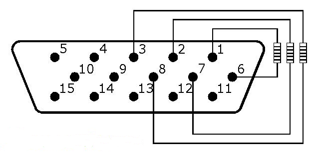

Ubuntu18.04系统启动时会扫描VGA接口，如果检测到没有连接显示器，那么系统彻底没有显示输出。这会导致用VNC连接系统时黑屏。解决办法是制作一个VGA的短接头，骗过系统，让系统认为连接了显示器。短接头的做法如下图所示，在VGA插头的1,6号插针，2,7号插针和3,8号插针之间连接三个电阻，阻值在50~100欧姆之间即可。



这样启动时系统会认为VGA端口上连接了一个老式的显示器，我这里连接的100欧姆电阻，启动后分辨率为1024x768。之后可以根据需要设置为想要的分辨率，以设置为1920x1080分辨率为例，设置方法如下：

1.打开终端，输入如下命令获得相应分辨率的Modeline

```
cvt 1920 1080
输出：
# 1920x1080 59.96 Hz (CVT 2.07M9) hsync: 67.16 kHz; pclk: 173.00 MHz
Modeline "1920x1080_60.00"  173.00  1920 2048 2248 2576  1080 1083 1088 1120 -hsync +vsync
```

2.创建分辨率模式：

```
xrandr --newmode "1920x1080_60.00"  173.00  1920 2048 2248 2576  1080 1083 1088 1120 -hsync +vsync
```

3.添加分辨率模式：

```
xrandr --addmode VGA-1 1920x1080_60.00
```

其中VGA-1是你的显卡，名字不一定跟我这里一样。可以在终端输入xrandr来查看。

以上3步完成后就可以在设置-设备-显示-分辨率里面看到有了1920x1080的选项，选择即可。

为了避免重启后失效，可以将第二步和第三步的命令添加到/etc/profile文件最后，这样每次启动时就自动将1920x1080这个分辨率模式添加进系统了。如下所示：

```
# /etc/profile: system-wide .profile file for the Bourne shell (sh(1))
# and Bourne compatible shells (bash(1), ksh(1), ash(1), ...).

if [ "${PS1-}" ]; then
  if [ "${BASH-}" ] && [ "$BASH" != "/bin/sh" ]; then
    # The file bash.bashrc already sets the default PS1.
    # PS1='\h:\w\$ '
    if [ -f /etc/bash.bashrc ]; then
      . /etc/bash.bashrc
    fi
  else
    if [ "`id -u`" -eq 0 ]; then
      PS1='# '
    else
      PS1='$ '
    fi
  fi
fi

if [ -d /etc/profile.d ]; then
  for i in /etc/profile.d/*.sh; do
    if [ -r $i ]; then
      . $i
    fi
  done
  unset i
fi

<b>xrandr --newmode "1920x1080_60.00"  173.00  1920 2048 2248 2576  1080 1083 1088 1120 -hsync +vsync
xrandr --addmode VGA-1 1920x1080_60.00</b>
```

