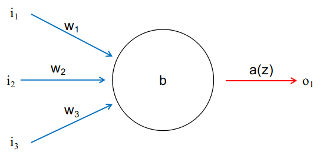

# 1. 神经元

神经元是神经网络的组成元素，任何结构的神经网络模型都是由若干个神经元以某种形式组成的。典型的神经元如图1-1所示。每个神经元可以有若干个输入和输出，一个神经元的输出可以连接到另一个神经元，变成另一个神经元的输入。因此输入和输出个数取决于有多少个神经元与该神经元相连接。

*
图1-1 神经元基本结构
*

为了简明图1-1只画了一个输出，图中黑色圆圈代表神经元，三条蓝色带箭头的线代表输入神经，红色带箭头的线代表输出神经。$$i_1,i_2,i_3$$为输入值（input），$$w_1,w_2,w_3$$为相对应的权重（weight），$$b$$为偏置（bias），$$a(z)$$为激活函数（activation），$$o_1$$为输出（output）。整个神经元的运作方式如下式：
$$
o_1=a( i_1\cdot w_1+i_2\cdot w_2+i_3\cdot w_3+b) \tag{1-1}
$$

上式描述了典型的神经元工作方式，输入和权重一一对应相乘后求和，然后再与偏置值求和，求和结果带入激活函数中，所得的函数值即为输出。

# 2. 神经网络