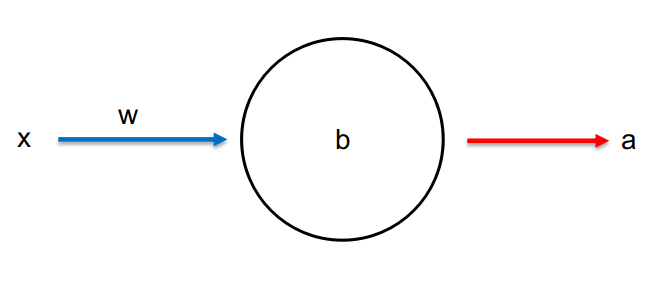

# 1.单个神经元网络

为了简化，我们设计一个最简单的神经网络，单神经元网络。网络中只有一个神经元，如图4-1所示。该神经元的训练目的也非常简单。我们希望当输入数据1给这个神经元时，其输出为0。

*
图4-1 单神经元网络
*

根据[二次损失函数](http://duxinyu.cn//teaching/2018-NN-2)的定义，单神经元网络的损失函数为：
$$
C=\frac{(y-a)^2}{2}\tag{4-1}
$$
式中a为当输入x=1时神经元的输出值，y=0是输入值为1时神经元的期望输出值。这里激活函数我们选用sigmoid函数，因此，a=\sigma (z)，z=wx+b。将其带入式4-1并对损失函数求偏微分可得：
$$
\frac{\partial C}{\partial w}=(a-y)\sigma'(z)x=a\sigma'(z)\tag{4-2}
$$

$$
\frac{\partial C}{\partial b}=(a-y)\sigma'(z)=a\sigma'(z)\tag{4-3}
$$

sigmoid函数如图4-2所示，当其函数值接近1时，曲线非常平坦，因此函数的导数\sigma'非常小。所以导致式4-2和4-3的值非常小。这是导致学习速度降低的根本原因。

*
图4-2 sigmoid函数
*

# 2.交叉熵损失函数

