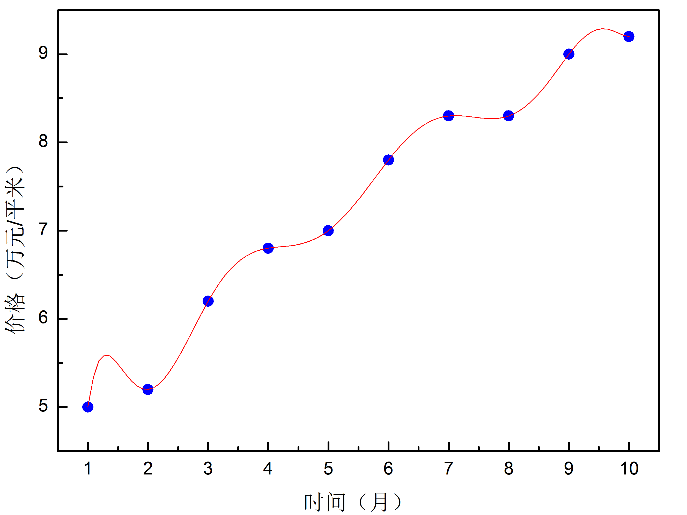

# 1.过拟合

在训练数据相对有限的情况下，训练好的神经网络可能会出现过拟合的问题。可以将其理解为由于训练数据有限，网络不能从中提炼出知识和规律，只是将训练数据死记硬背了下来。所以当对训练数据之外的数据进行运算时，其结果与实际情况会出现较大的偏差。就好比一个小朋友学习算数，我们只教给他1+1=2,1+2=3，这时他还没有真正明白加法的意义和规则。那么这时让他去算1+3=？的时候，结果往往是不正确的。假设图4-1中蓝色点代表不同时间北京的房价，红色曲线是多项式拟合曲线。可以发现红色曲线完美的穿过了所有数据点，但是用该曲线预测房价肯定会得出可笑的结论。而如图4-2所示的线性拟合，红色直线并没有穿过所有的数据点，但是数据的走势被很明确的描绘了出来。因此，用这条直线来预测将来的房价是很有指导意义的。过拟合是我们需要尽量避免的一种情况，过拟合会导致模型在训练数据集上准确度很高，而在测试数据集上准确度很低。下面介绍一下怎样避免过拟合的问题出现。

*
图4-1 过拟合状态
*

*
图4-2 线性拟合
*

# 2.扩大训练数据集

过拟合的出现是因为训练数据不足，因此最简单的办法就是扩大训练数据集的规模。然而数据的采集往往是十分耗费人力，物力，财力的。所以在实际操作过程中可以采取人为制造数据的方法。比如在语音识别数据中添加一些背景噪音，对图像识别的数据进行几何变换，如旋转角度，镜像等等。这在实际操作中确实可以达到提高模型准确度的目的。