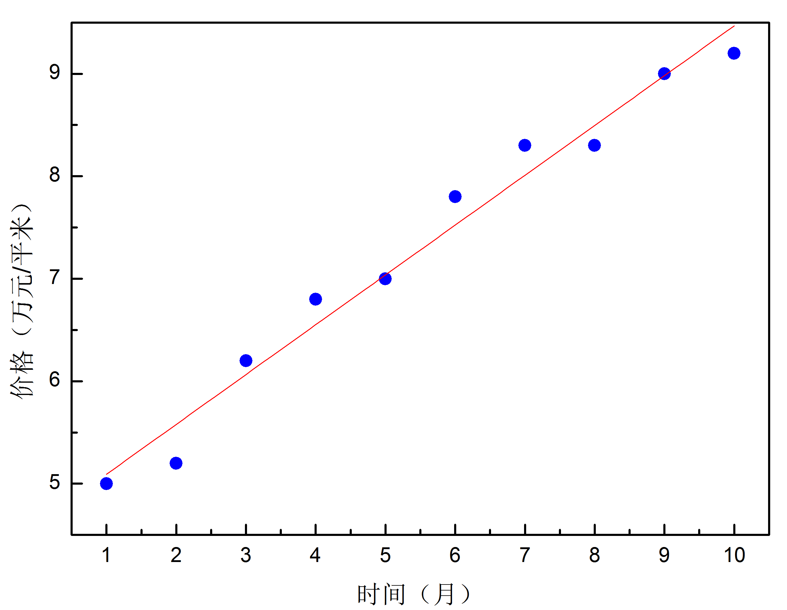

# 1.过拟合

在训练数据相对有限的情况下，训练好的神经网络可能会出现过拟合的问题。可以将其理解为由于训练数据有限，网络不能从中提炼出知识和规律，只是将训练数据死记硬背了下来。所以当对训练数据之外的数据进行运算时，其结果与实际情况会出现较大的偏差。就好比一个小朋友学习算数，我们只教给他1+1=2,1+2=3，这时他还没有真正明白加法的意义和规则。那么这时让他去算1+3=？的时候，结果往往是不正确的。假设图4-1中蓝色点代表不同时间北京的房价，红色曲线是多项式拟合曲线。可以发现红色曲线完美的穿过了所有数据点，但是用该曲线预测房价肯定会得出可笑的结论。而如图4-2所示的线性拟合，红色直线并没有穿过所有的数据点，但是数据的走势被很明确的描绘了出来。因此，用这条直线来预测将来的房价是很有指导意义的。过拟合是我们需要尽量避免的一种情况，过拟合会导致模型在训练数据集上准确度很高，而在测试数据集上准确度很低。下面介绍一下怎样避免过拟合的问题出现。

*
图5-1 过拟合状态
*

*
图5-2 线性拟合
*

# 2.扩大训练数据集

过拟合的出现是因为训练数据不足，因此最简单的办法就是扩大训练数据集的规模。然而数据的采集往往是十分耗费人力，物力，财力的。所以在实际操作过程中可以采取人为制造数据的方法。比如在语音识别数据中添加一些背景噪音，对图像识别的数据进行几何变换，如旋转角度，镜像等等。这在实际操作中确实可以达到提高模型准确度的目的。

# 3.Dropout方法

Dropout是目前应用最广泛的避免过拟合的方法。其思路是暂时随机的砍掉隐藏层中的一些神经元，然后使用训练数据对网络进行训练，在更新了一次权重和偏移量后恢复砍掉的神经元，然后再随机砍掉一些后进行训练。如此往复进行下去。整个过程相当于我们训练了许多不同结构的网络来完成同一件事情，因为每次随机砍掉一些神经元后都形成了一个新的网络。因此，得到的结果是许多网络得到结果的平均。这种平均后的结果的准确度比单一网络输出结果的准确度要高。因此，dropout技术在某种程度上客服了过拟合的现象。另一种理解方式是，在训练过程中随机砍掉一些神经元，有助于破坏网络记忆数据，从而更专注于理解数据背后的规律。

# 4.正则化损失函数

正则化技术也可以降低过拟合，其中最著名的要数L2正则化。L2正则非常简单，就是在损失函数后再加一项，称为正则项。以交叉熵损失函数为例，正则化后函数形式为：
$$
C=-\frac {1}{n}\sum_{x_j}[y_jlna_j^L+(1-y_j)ln(1-a_j^L)]+\frac{\lambda}{2n}\sum_w w^2\tag{5-1}
$$
第一项为交叉熵损失函数，第二项为所有权重平方的和乘以\frac{\lambda}{2n}。\lambda>0称为**正则化参数**。n为训练数据的个数。这种技术对于其他类型的损失函数也适用，一般的可以表示为：
$$
C=C_0+\frac{\lambda}{2n}\sum_w w^2\tag{5-2}
$$
其中C_0是未正则化的损失函数。训练过程就是最小化损失函数的过程，因此当加入了正则项后，网络倾向于学习小的权重。正则化参数用来调整那部分更重要，比如当\lambda很小时，我们倾向于最小化原始的损失函数，反之我们倾向于得到小的权重。正则化后损失函数对权重和偏移量的偏导数为：
$$
\frac{\partial C}{\partial w}=\frac{\partial C_0}{\partial w}+\frac{\lambda}{n}w\tag{5-3}
$$

$$
\frac{\partial C}{\partial b}=\frac{\partial C_0}{\partial b}\tag{5-4}
$$

因此，在用反向传播法时只需在对$$w$$偏微分的地方加上$$\frac{\lambda}{n}w$$项即可。权重和偏移量的更新规则为：
$$
w'=w-\eta\frac{\partial C_0}{\partial w}-\frac{\eta\lambda}{n}w=(1-\frac{\eta\lambda}{n})w-\eta\frac{\partial C_0}{\partial w}\tag{5-5}
$$

$$
b'=b-\eta\frac{\partial C_0}{\partial b}\tag{5-6}
$$

式5-5等号右边第一项使得权重越来越小，但是第二项会相应的补偿。如果只有第一项那么不断更新下去的话权重最终为0。对随机梯度下降法来说，更新规则为：
$$
w'=(1-\frac{\eta\lambda}{n})w-\frac{\eta}{m}\sum_x\frac{\partial C_x}{\partial w}\tag{5-7}
$$

$$
b'=b-\frac{\eta}{m}\sum_x\frac{\partial C_x}{\partial b}\tag{5-8}
$$

从数学的角度很难理解为什么损失函数加入正则化项后就可以避免过拟合现象。直觉上我们可以这么理解：当加入正则化项后，在最小化损失函数时也会把权重的值往小优化。当权重值比较小时，对输入值就不那么敏感了。因此，训练出的模型更能体现数据背后的规律，入图5-2所示。相反，当权重比较大时，网络对输入值太敏感。因此，训练出的模型更倾向于准确的描述训练数据而不是得到数据背后的规律，如图5-1所示。